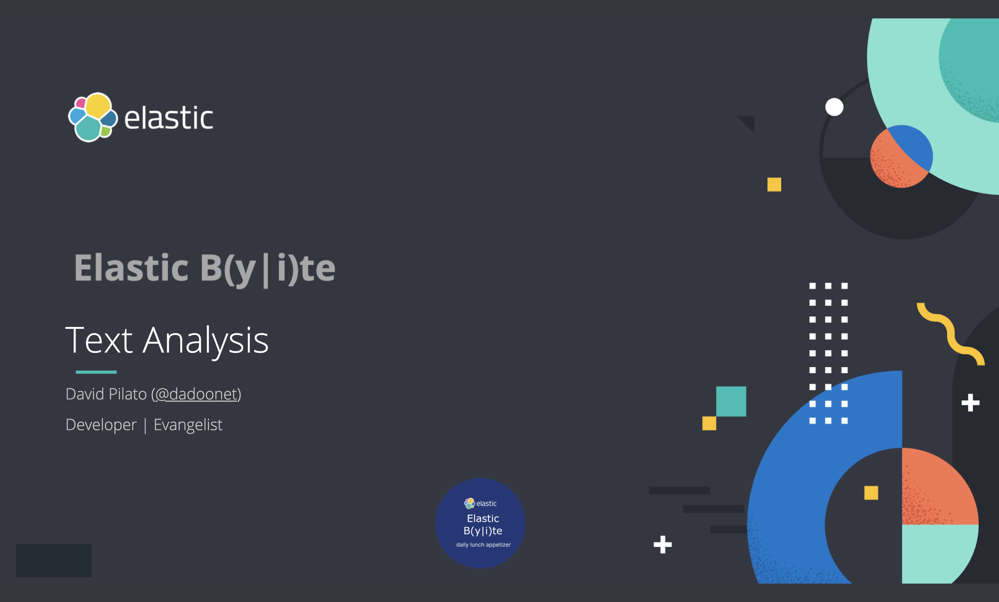

# Demo scripts used for Elastic Daily Bytes - Text Analysis



## Setup

The setup will check that Elasticsearch and Kibana are running.

It will also add Kibana Canvas slides.

### Run on cloud (recommended)

This specific configuration is used to run the demo on a [cloud instance](https://cloud.elastic.co).
You need to create a `.cloud` local file which contains:

```
CLOUD_ID=the_cloud_id_you_can_read_from_cloud_console
CLOUD_PASSWORD=the_generated_elastic_password
```

Run:

```sh
./setup.sh
```

### Run Locally

Run Elastic Stack:

```sh
docker-compose down -v
docker-compose up
```

And run:

```sh
./setup.sh
```

## Demo part

If you don't analyze the text, only exact matches will work.
At index time `The quick brown FOX.` will be indexed as `The quick brown FOX.`.

```
POST _analyze
{
  "analyzer": "keyword",
  "text":     "The quick brown FOX."
}
```

At search time `fox` won't match but only `The quick brown FOX.`.

```
POST _analyze
{
  "analyzer": "keyword",
  "text":     ["fox", "The quick brown FOX." ]
}
```

### Whitespace analyzer

The `whitespace` analyzer might help a bit.
At index time it will produce `The`, `quick`, `brown` and `FOX.`.

```
POST _analyze
{
  "analyzer": "whitespace",
  "text":     "The quick brown FOX."
}
```

At search phase, only `brown` and `FOX.` will match. `fox` won't match.

```
POST _analyze
{
  "analyzer": "whitespace",
  "text":     [ "brown fox", "FOX." ]
}
```

### Standard analyzer

Let's do better with the `standard` analyzer. Everything will match now.

```
# Index phase
POST _analyze
{
  "analyzer": "standard",
  "text":     "The quick brown FOX."
}

# Search phase
POST _analyze
{
  "analyzer": "standard",
  "text":     [ "brown fox", "FOX." ]
}
```

### Language analyzer

When you want to deal with languages like French... A word like `éléphant` (which means "elephant") has some diacritics like `é`, `è`, `ê`, `à`, `ç`...
At index and search phases you will need to match exactly with the same characters. `elephant` won't match `éléphant`.

```
## Index phase
POST _analyze
{
  "analyzer": "standard",
  "text":     "Here is an éléphant in french"
}
## Search phase
POST _analyze
{
  "analyzer": "standard",
  "text":     [ "elephant", "éléphant" ]
}
```

But the `french` analyzer is using an asciifolding token filter which do the job.

```
## Index phase
POST _analyze
{
  "analyzer": "french",
  "text":     "Here is an éléphant in french"
}
## Search phase
POST _analyze
{
  "analyzer": "french",
  "text":     [ "elephant", "éléphant" ]
}
```

### What is an analyzer?

An analyzer is made of character filters, tokenizer and token filters.

Let's build one, step by step to be able to index:

> I like when the <strong>quick</strong> foxes jumps over lazy DOGS!

And search for:

> 👍 🐶 and <strong>fast</strong> 🦊!.

So we start with an "empty" analyzer. Not that empty as it yet contains a `standard` tokenizer.

```
POST _analyze
{
  "char_filter": [], 
  "tokenizer":   "standard",
  "filter":      [], 
  "text": [ 
    "I like when the <strong>quick</strong> foxes jumps over lazy DOGS!",
    "👍 🐶 and <strong>fast</strong> 🦊!."
  ]
}
```

Let's remove the html code.

```
POST _analyze
{
  "char_filter": ["html_strip"], 
  "tokenizer":   "standard",
  "filter":      [
  ], 
  "text":
  [ 
    "I like when the <strong>quick</strong> foxes jumps over lazy DOGS!",
    "👍 🐶 and <strong>fast</strong> 🦊!."
  ]
}
```

Some words don't bring us any value. Let's skip them.

```
POST _analyze
{
  "char_filter": ["html_strip"], 
  "tokenizer":   "standard",
  "filter":      [
    {
      "type":       "stop",
      "stopwords":  [ "_english_"]
    }
  ], 
  "text":
  [ 
    "I like when the <strong>quick</strong> foxes jumps over lazy DOGS!",
    "👍 🐶 and <strong>fast</strong> 🦊!."
  ]
}
```

We can also remove "I", "when" and "over".

```
POST _analyze
{
  "char_filter": ["html_strip"], 
  "tokenizer":   "standard",
  "filter":      [
    {
      "type":       "stop",
      "ignore_case":true, 
      "stopwords":  [ "_english_", "I", "when", "over"]
    }
  ], 
  "text":
  [ 
    "I like when the <strong>quick</strong> foxes jumps over lazy DOGS!",
    "👍 🐶 and <strong>fast</strong> 🦊!."
  ]
}
```

`DOGS` and `dogs` should match.

```
POST _analyze
{
  "char_filter": ["html_strip"], 
  "tokenizer":   "standard",
  "filter":      [
    {
      "type":       "stop",
      "ignore_case":true, 
      "stopwords":  [ "_english_", "I", "when", "over"]
    },
    "lowercase"
  ], 
  "text":
  [ 
    "I like when the <strong>quick</strong> foxes jumps over lazy DOGS!",
    "👍 🐶 and <strong>fast</strong> 🦊!."
  ]
}
```

`dog`, `dogs` and `fox`, `foxes` and `jump`, `jumps`, `jumping`, `jumped` should match. Let's use a `stemmer`.

```
POST _analyze
{
  "char_filter": ["html_strip"], 
  "tokenizer":   "standard",
  "filter":      [
    {
      "type":       "stop",
      "ignore_case":true, 
      "stopwords":  [ "_english_", "I", "when", "over"]
    },
    "lowercase",
    {
      "type":       "stemmer",
      "language":   "english" 
    }
  ], 
  "text":
  [ 
    "jumping jumps jump jumped",
    "I like when the <strong>quick</strong> foxes jumps over lazy DOGS!",
    "👍 🐶 and <strong>fast</strong> 🦊!."
  ]
}
```

We can search for emojis using synonyms.

```
POST _analyze
{
  "char_filter": ["html_strip"], 
  "tokenizer":   "standard",
  "filter":      [
    {
      "type":       "stop",
      "ignore_case":true, 
      "stopwords":  [ "_english_", "I", "when", "over"]
    },
    "lowercase",
    {
      "type":       "stemmer",
      "language":   "english" 
    },
    {
      "type": "synonym",
      "lenient": true,
      "synonyms": [
        "fast => quick",
        "🐶 => dog",
        "👍 => like",
        "🦊 => fox"
      ]
    }
  ], 
  "text":
  [ 
    "I like when the <strong>quick</strong> foxes jumps over lazy DOGS!",
    "👍 🐶 and <strong>fast</strong> 🦊!."
  ]
}
```

[Damien Alexandre](https://github.com/damienalexandre) provided a [curated list of synonyms](https://github.com/jolicode/emoji-search/tree/master/synonyms) at https://github.com/jolicode/emoji-search. It's available for many languages.

## ngrams and edge ngrams

When you want to do partial matching, you can use `ngram` and `edge_ngram` token filters.
Here we will produce:

* `co`, `com`, `comm`, `commu` for `community`
* `co`, `con`, `conv`, `conve` for `convention`

```
POST _analyze
{
  "tokenizer":   "standard",
  "filter":      [
    { 
      "type": "edge_ngram",
      "min_gram": 2,
      "max_gram": 5
    }
  ], 
  "text": [ 
    "community",
    "convention"
  ]
}
```

But be careful. If you are using the same analyzer at search time, this will produce unexpected results. As here `con` will produces `co` and `con`. And `co` is matching `community` **and** `convention`.

```
POST _analyze
{
  "tokenizer":   "standard",
  "filter":      [
    { 
      "type": "edge_ngram",
      "min_gram": 2,
      "max_gram": 5
    }
  ], 
  "text": [ 
    "con"
  ]
}
```

To fix that behavior, use another analyzer at search time like the `simple` analyzer.

```
POST _analyze
{
  "tokenizer":   "simple", 
  "text": [ 
    "con"
  ]
}
```

## Shingles, you know. For potatoes!

In french "pomme de terre" is a potatoe. But the word to word translation is "apple from earth".
"pomme" is an "apple".

If you index `pomme grany` and `pomme de terre`, they will be considered the same way by elasticsearch and will weight the same when searching. So if you search for "pomme de terre" (potatoe), it can give you in the first position an apple.

```
POST _analyze
{
  "tokenizer":   "standard",
  "filter": [ 
  ], 
  "text": [
    "pomme de terre",
    "pomme grany"
  ]
}
```

With shingles, at index and search time, `pomme de terre`is tokenized as:

* `pomme`
* `pomme de`
* `pomme de terre`
* `de terre`
* `terre`

Which means that at search time, it will match 5 times where `pomme` will match only once and will score lower.

```
POST _analyze
{
  "tokenizer":   "standard",
  "filter": [ 
    { 
      "type": "shingle",
      "max_shingle_size": 3
    }
  ], 
  "text": [
    "pomme de terre",
    "pomme grany"
  ]
}
```

## Fun stuff

The order of token filters really matters. The following produces nothing.

```
GET _analyze
{
  "explain": true, 
  "tokenizer": "whitespace", 
  "filter":  [ "lowercase", "stop" ],
  "text": "To Be Or Not To Be"
}
```

Where this one produces the expected text.

```
GET _analyze
{
  "explain": true, 
  "tokenizer": "whitespace", 
  "filter":  [ "stop", "lowercase" ],
  "text": "To Be Or Not To Be"
}
```

Note that `"explain": true` helps to understand the whole analysis process.

